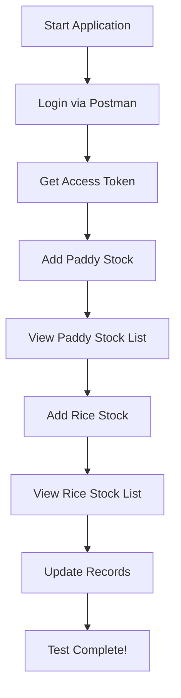

# 🎯 POSTMAN TESTING - QUICK START GUIDE

## ✅ What You Have

I've created **3 comprehensive files** for Postman testing:

### 📄 Files Created:

1. **POSTMAN_TESTING_GUIDE.md** - Complete guide with examples and explanations
2. **POSTMAN_CURL_COMMANDS.txt** - Simple copy-paste cURL commands  
3. **quick-curl-commands.sh** - Interactive script to display all commands
4. **Rice_Mill_APIs.postman_collection.json** - Ready-to-import Postman collection

---

## 🚀 Quick Start (3 Steps)

### Step 1: Start the Application
```bash
cd /Users/dulandinuja/Desktop/D/Rice_Mill_Backend
mvn spring-boot:run
```

Wait until you see:
```
Started RiceMillApplication in X.XXX seconds
Tomcat started on port 8080 (http)
```

### Step 2: Open Postman and Import Collection

**Option A: Import the JSON Collection**
1. Open Postman
2. Click **Import** (top left)
3. Select **File** → Choose `Rice_Mill_APIs.postman_collection.json`
4. Click **Import**
5. ✅ All requests are ready!

**Option B: Manual Import Using cURL**
1. Open `POSTMAN_CURL_COMMANDS.txt`
2. Copy any cURL command
3. In Postman, click **Import** → **Raw Text**
4. Paste the cURL command
5. Click **Import**

### Step 3: Test the APIs

1. **First, run LOGIN:**
   - Find the "Login" request in Postman
   - Click **Send**
   - Copy the `accessToken` from response

2. **Set the token as environment variable:**
   - Click **Environments** (left sidebar)
   - Create new environment "Rice Mill Dev"
   - Add variable: `token` = `paste_your_token_here`
   - Save

3. **Test Paddy Stock:**
   - Run "Add Paddy Stock"
   - Run "Get All Paddy Stock"
   - Copy an ID from the list
   - Run "Get Paddy Stock by ID"

4. **Test Rice Stock:**
   - Run "Add Rice Stock"
   - Run "Get All Rice Stock"
   - Copy an ID from the list
   - Run "Get Rice Stock by ID"

---

## 📋 Ready-to-Use cURL Commands

### 1️⃣ Login (Get Token)
```bash
curl --location 'http://localhost:8080/api/v1/auth/login' \
--header 'Content-Type: application/json' \
--data '{
    "usernameOrEmail": "admin",
    "password": "admin123"
}'
```

**Response:**
```json
{
    "success": true,
    "data": {
        "accessToken": "eyJhbGci...", // ← COPY THIS
        "user": { "username": "admin" }
    }
}
```

### 2️⃣ Add Paddy Stock
```bash
curl --location 'http://localhost:8080/api/v1/paddy-stock/add' \
--header 'Content-Type: application/json' \
--header 'Authorization: Bearer YOUR_TOKEN_HERE' \
--data '{
    "paddyType": "Basmati",
    "quantity": 1000,
    "pricePerKg": 50,
    "supplier": "ABC Suppliers",
    "supplierContact": "9876543210",
    "purchaseDate": "2026-02-03",
    "warehouseLocation": "Warehouse A",
    "moistureContent": 14.5,
    "qualityGrade": "A",
    "batchNumber": "PADDY-20260203-0001",
    "notes": "Premium Basmati"
}'
```

### 3️⃣ Get All Paddy Stock
```bash
curl --location 'http://localhost:8080/api/v1/paddy-stock?page=0&size=10' \
--header 'Authorization: Bearer YOUR_TOKEN_HERE'
```

### 4️⃣ Add Rice Stock
```bash
curl --location 'http://localhost:8080/api/v1/rice-stock/add' \
--header 'Content-Type: application/json' \
--header 'Authorization: Bearer YOUR_TOKEN_HERE' \
--data '{
    "riceType": "White Rice",
    "variety": "Basmati Premium",
    "quantity": 800,
    "packageType": "25KG",
    "numberOfPackages": 32,
    "pricePerKg": 80,
    "processingDate": "2026-02-03",
    "expiryDate": "2027-02-03",
    "warehouseLocation": "Warehouse B",
    "qualityGrade": "Premium",
    "batchNumber": "RICE-20260203-0001",
    "sourcePaddyBatch": "PADDY-20260203-0001",
    "notes": "Premium white rice"
}'
```

### 5️⃣ Get All Rice Stock
```bash
curl --location 'http://localhost:8080/api/v1/rice-stock?page=0&size=10' \
--header 'Authorization: Bearer YOUR_TOKEN_HERE'
```

---

## 🎨 Postman Setup Tips

### Auto-Save Token After Login

In your Login request, add this to the **Tests** tab:

```javascript
if (pm.response.code === 200) {
    var jsonData = pm.response.json();
    pm.environment.set("token", jsonData.data.accessToken);
    console.log("✅ Token saved!");
}
```

Now every time you login, the token is automatically saved!

### Use Token in Requests

In your requests, set Authorization header as:
```
Authorization: Bearer {{token}}
```

The `{{token}}` will automatically use the saved token.

---

## 🔍 Testing Checklist

- [ ] Login and get token ✅
- [ ] Add Paddy Stock (3 entries) ✅
- [ ] Get All Paddy Stock ✅
- [ ] Get Paddy Stock by ID ✅
- [ ] Update Paddy Stock ✅
- [ ] Add Rice Stock (3 entries) ✅
- [ ] Get All Rice Stock ✅
- [ ] Get Rice Stock by ID ✅
- [ ] Update Rice Stock ✅
- [ ] Test pagination ✅
- [ ] Test sorting ✅

---

## 🐛 Common Issues

### "Unauthorized" Error (401)
**Problem:** Token expired or missing  
**Solution:** Run LOGIN again and update the token

### "Batch number already exists" (409)
**Problem:** Duplicate batch number  
**Solution:** Change batch number to unique value (e.g., `PADDY-20260203-0004`)

### "Connection refused"
**Problem:** Application not running  
**Solution:** 
```bash
cd /Users/dulandinuja/Desktop/D/Rice_Mill_Backend
mvn spring-boot:run
```

### Port 8080 already in use
**Problem:** Another app using the port  
**Solution:**
```bash
lsof -ti:8080 | xargs kill -9
```

---

## 📊 Expected Responses

### Success Response (200/201)
```json
{
    "success": true,
    "message": "Operation successful",
    "data": {
        "id": "uuid-here",
        "paddyType": "Basmati",
        "quantity": 1000,
        // ... more fields
    }
}
```

### Error Response (400/401/404)
```json
{
    "success": false,
    "message": "Error description here",
    "timestamp": "2026-02-03T10:30:00"
}
```

---

## 🌐 Useful URLs

- **Swagger UI:** http://localhost:8080/api/swagger-ui.html
- **API Docs:** http://localhost:8080/api/docs  
- **Health Check:** http://localhost:8080/actuator/health

---

## 📚 All Documentation Files

| File | Purpose |
|------|---------|
| `POSTMAN_TESTING_GUIDE.md` | Complete testing guide with examples |
| `POSTMAN_CURL_COMMANDS.txt` | Simple copy-paste cURL commands |
| `quick-curl-commands.sh` | Interactive command display script |
| `Rice_Mill_APIs.postman_collection.json` | Import into Postman |
| `PADDY_RICE_API_TESTING_GUIDE.md` | Detailed API documentation |
| `FRONTEND_CONFIG.js` | Frontend integration config |
| `FRONTEND_INTEGRATION_GUIDE.md` | Frontend setup guide |

---

## ⚡ Quick Test (One Command)

Want to test everything quickly? Run:

```bash
./test-apis.sh
```

This will:
1. Login automatically
2. Add sample paddy stock
3. Add sample rice stock
4. Show all results

---

## 🎯 Testing Workflow



---

## ✨ Summary

You now have:
- ✅ Complete Postman collection ready to import
- ✅ All cURL commands in easy copy-paste format
- ✅ Comprehensive testing guide
- ✅ Auto-token setup for Postman
- ✅ Sample test data
- ✅ Error handling guide

**Just start the application and begin testing!** 🚀

---

## 📞 Need Help?

1. **Check if app is running:**
   ```bash
   curl http://localhost:8080/actuator/health
   ```

2. **View application logs:**
   ```bash
   tail -f /Users/dulandinuja/Desktop/D/Rice_Mill_Backend/app.log
   ```

3. **View all commands:**
   ```bash
   ./quick-curl-commands.sh
   ```

---

**Happy Testing! 🎉**

All files are ready in your project directory:
`/Users/dulandinuja/Desktop/D/Rice_Mill_Backend/`

